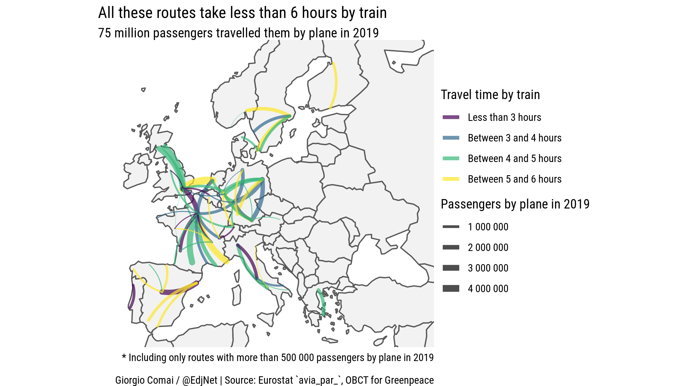

<!-- README.md is generated from README.Rmd. Please edit that file -->

# Busiest European plane routes that can be travelled by train, with coordinates and identifiers

See the [dedicated page](https://edjnet.github.io/european_routes/) for
context and details.

Find below a preview of the datasets generated during the process.

## Datasets

-   [`european_routes_ranking.csv`](data/european_routes_ranking.csv): 3
    889 rows, 13 columns: ‘ranking’, ‘type’, ‘route_code’, ‘passengers’,
    ‘route_name’, ‘origin_airport_code’, ‘origin_airport_country’,
    ‘origin_airport_icao’, ‘origin_airport_name’,
    ‘destination_airport_code’, ‘destination_airport_country’,
    ‘destination_airport_icao’, and ‘destination_airport_name’
-   [`european_routes_ranking_with_turkey.csv`](data/european_routes_ranking_with_turkey.csv):
    same as above, but including data from Turkey
-   [airport_qid_icao_details.csv](data/airport_qid_icao_details.csv):
    this is a dataset with details on all items with an ICAO code in
    Wikidata across the world, completely based on Wikidata, and used
    for matching (be mindful about duplicates and potential data issues
    in particular with minor airfields): 20 255 rows, 16 columns:
    ‘airport_qid’, ‘airport’, ‘country_qid’, ‘country’,
    ‘administrative_entity_qid’, ‘administrative_entity’, ‘latitude’,
    ‘longitude’, ‘iata_code’, ‘icao_code’, ‘hub_qid’, ‘hub’,
    ‘hub_latitude’, ‘hub_longitude’, ‘replaced_by_qid’, and
    ‘replaced_by_icao_code’
-   [`airport_qid_unique_icao_details.csv`](data/airport_qid_unique_icao_details.csv):
    same as above, but without duplicates, and probably more suitable
    for most use cases: 19 932 rows, 16 columns: ‘airport_qid’,
    ‘airport’, ‘country_qid’, ‘country’, ‘administrative_entity_qid’,
    ‘administrative_entity’, ‘latitude’, ‘longitude’, ‘iata_code’,
    ‘icao_code’, ‘hub_qid’, ‘hub’, ‘hub_latitude’, ‘hub_longitude’,
    ‘replaced_by_qid’, and ‘replaced_by_icao_code’
-   [`european_airports_with_wikidata_details.csv`](data/european_airports_with_wikidata_details.csv):
    dataset with details on all airports that actually appear in
    Eurostat’s `avia_par_` datasets. All of them have a set of
    coordinates: 429 rows, 15 columns: ‘country’, ‘icao_code’,
    ‘airport_qid’, ‘airport’, ‘country_qid’, ‘country_name’,
    ‘administrative_entity_qid’, ‘administrative_entity’, ‘latitude’,
    ‘longitude’, ‘iata_code’, ‘hub_qid’, ‘hub’, ‘hub_latitude’, and
    ‘hub_longitude’
-   [`european_airports_with_wikidata_details_fixed_hubs.csv`](data/european_airports_with_wikidata_details_fixed_hubs.csv):
    similar to the above, but now each row also has a “hub”, i.e. the
    main city or location served by the airport, with relevant
    coordinates and Wikidata identifier. 429 rows, 15 columns:
    ‘country’, ‘icao_code’, ‘airport_qid’, ‘airport’, ‘country_qid’,
    ‘country_name’, ‘administrative_entity_qid’,
    ‘administrative_entity’, ‘latitude’, ‘longitude’, ‘iata_code’,
    ‘hub_qid’, ‘hub’, ‘hub_latitude’, and ‘hub_longitude’
-   [`european_hub_routes.csv`](data/european_hub_routes.csv): dataset
    with all European flights routes merged by hub (e.g. all London
    airports are summed together as a single destination). 3 318 rows,
    12 columns: ‘ranking’, ‘route’, ‘passengers’, ‘origin_hub’,
    ‘origin_hub_qid’, ‘origin_hub_latitude’, ‘origin_hub_longitude’,
    ‘destination_hub’, ‘destination_hub_qid’,
    ‘destination_hub_latitude’, ‘destination_hub_longitude’, and
    ‘distance_km’
-   [`european_hub_land_routes.csv`](data/european_hub_land_routes.csv):
    similar to the above, but only routes that can plausibly be
    travelled by land are included. 2 345 rows, 12 columns: ‘ranking’,
    ‘route’, ‘passengers’, ‘distance_km’, ‘origin_hub’,
    ‘origin_hub_qid’, ‘origin_hub_latitude’, ‘origin_hub_longitude’,
    ‘destination_hub’, ‘destination_hub_qid’,
    ‘destination_hub_latitude’, and ‘destination_hub_longitude’
-   [`train_routes.csv`](data_train_routes/train_routes.csv). This is
    the original dataset produced by OBC Transeuropa for Greenpeace. 575
    rows, 22 columns: ‘ID’, ‘top 150 intra-EU routes’, ‘top 250 European
    routes’, ‘Type of connection’, ‘Connected countries’, ‘N. of air
    passengers (2019)’, ‘Connection’, ‘Origin’, ‘Destination’, ‘via’,
    ‘N. of transfers (2019)’, ‘Is a night train involved? (2019)’, ‘Time
    of departure (2019)’, ‘Time of arrival (2019)’, ‘Duration of day
    trips (2019)’, ‘Duration of trips involving night trains (2019)’,
    ‘Duration of trips (2019)’, ‘Distance’, ‘Average speed of the
    journey (2019)’, ‘N. of weekly direct connections (2019)’, ‘Shortest
    duration in 2021’, and ‘Notes’
-   [`train_routes_coords.csv`](data/train_routes_coords.csv). Same as
    above, but with matching coordinates for the arrival and departure,
    distance, and unique identifiers that enables matching with previous
    datasets listed here or getting more data from Wikidata. 584 rows,
    32 columns: ‘ID’, ‘top 150 intra-EU routes’, ‘top 250 European
    routes’, ‘Type of connection’, ‘Connected countries’, ‘N. of air
    passengers (2019)’, ‘Connection’, ‘Origin’, ‘Destination’, ‘via’,
    ‘N. of transfers (2019)’, ‘Is a night train involved? (2019)’, ‘Time
    of departure (2019)’, ‘Time of arrival (2019)’, ‘Duration of day
    trips (2019)’, ‘Duration of trips involving night trains (2019)’,
    ‘Duration of trips (2019)’, ‘Distance’, ‘Average speed of the
    journey (2019)’, ‘N. of weekly direct connections (2019)’, ‘Shortest
    duration in 2021’, ‘Notes’, ‘origin_hub_qid’, ‘origin_latitude’,
    ‘origin_longitude’, ‘destination_hub_qid’, ‘destination_latitude’,
    ‘destination_longitude’, ‘distance_air_km’,
    ‘distance_difference_km’, ‘route_qid’, and ‘passengers’

## License

This repository and related dataset is distributed under a Creative
Commons CC BY license.

The dataset on trains has been produced by OBC Transeuropa for
Greenpeace. Read the [full
report](https://www.balcanicaucaso.org/eng/Occasional-papers/Train-alternatives-to-short-haul-flights-in-Europe),
or check out [this article by Lorenzo Ferrari and Gianluca De
Feo](https://www.europeandatajournalism.eu/eng/News/Data-news/More-trains-fewer-emissions)
for context.

Data on flights have been distributed by Eurostat. See the `avia_par_`
dataset for licensing and more details.

Code and datasets in this repository are by Giorgio Comai/OBCT/EDJNet.
